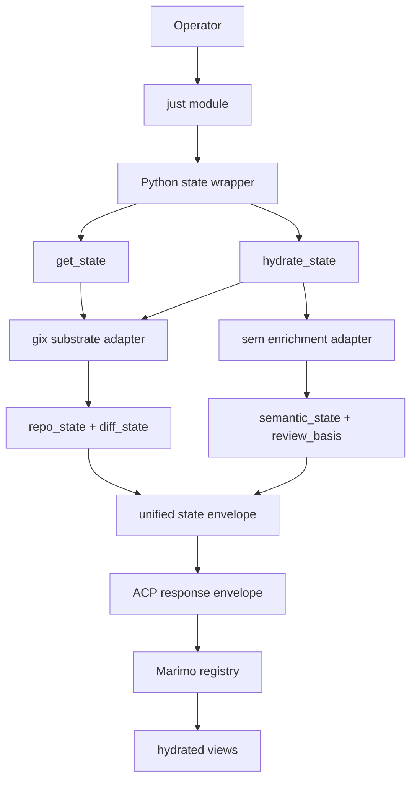
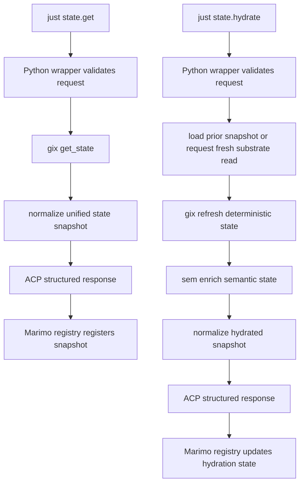

# State-First Workflow DAG

## North Star

The primary interface is a state service:
- `get_state`
- `hydrate_state`

The operator entrypoint is a `just` module.
`just` wraps Python, Python wraps `gix` and `sem`, and structured output crosses ACP into the Marimo registry/view layer.

## Architecture DAG

## Workflow DAG

## Operational Rules

- `get_state` is side-effect free and idempotent.
- `hydrate_state` refreshes and enriches snapshots; it does not write to the repo.
- ACP carries transport metadata and structured payloads only.
- Marimo owns snapshot registration, indexing, hydration lifecycle, and views.
- `gix` remains the deterministic Git fact source.
- `sem` remains downstream enrichment over deterministic diff input.
