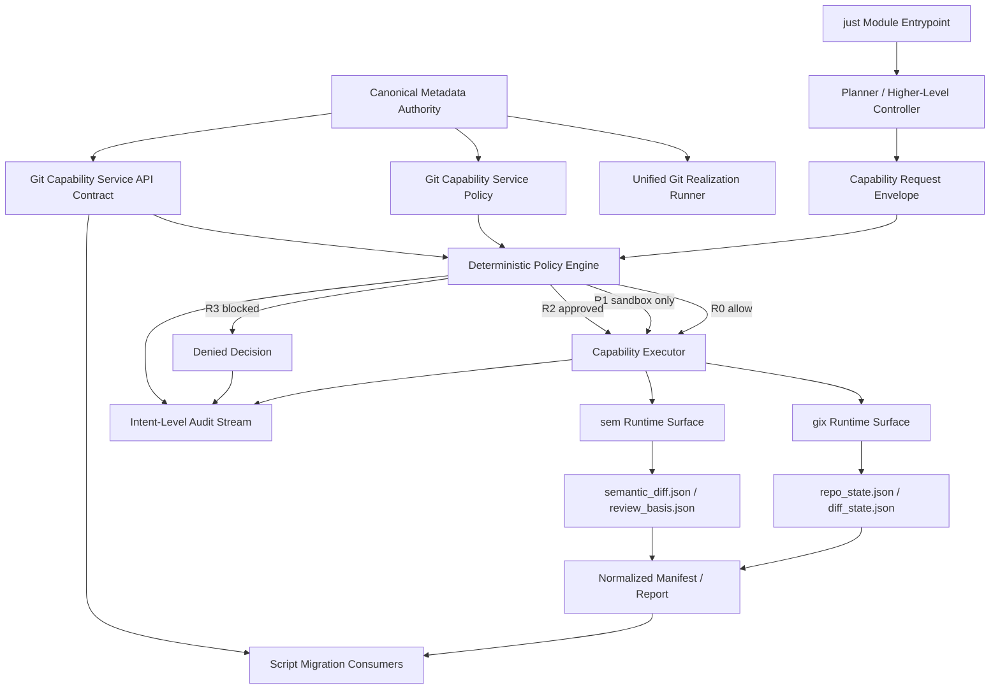
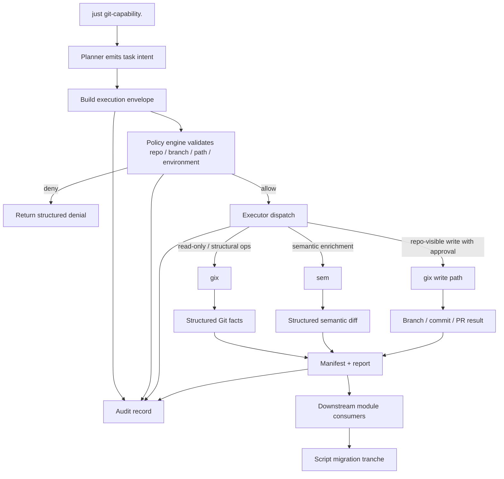

# Git Capability Service Workflow DAG

Assumptions for this DAG:
- the post-adapter next steps are already synced
- the operator entrypoint is a `just` module, not a loose script
- `gix` and `sem` are already closed for the first real-runtime tranche

## Architecture DAG

## Workflow DAG

## Interpretation

- `just` is the operational entrypoint module.
- Planner output is intent only; it does not carry Git policy.
- Policy is deterministic and external to the model.
- The executor is thin and only dispatches approved task-shaped operations.
- `gix` handles deterministic Git facts.
- `sem` handles semantic enrichment downstream of deterministic diff capture.
- All durable output is structured data plus normalized manifest/report and audit streams.
- Script migration consumes the service contract instead of using raw Git/runtime surfaces directly.
